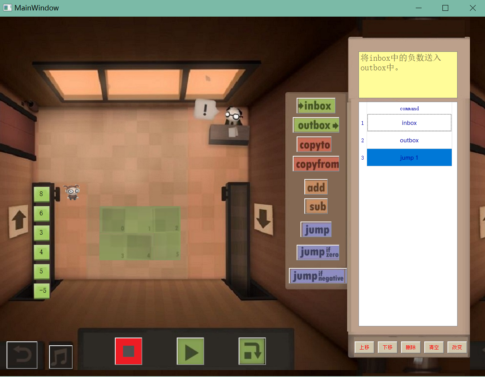

## Human resource machine 需求分析

----

### 主题

---

现在面向青少年的益智编程游戏层出不穷。本项目主要实现一个基于视觉编程的益智游戏，玩家需要调整右侧类似于汇编语言的命令，来控制工具人的移动，从而将输入中符合要求的方块放到输出中。

### 系统需求

------

win10

### 界面设计

----

#### 主界面说明

- 中央是人物以及方块，可以随着命令的改变而进行移动

- 返回按钮
- 音乐播放按钮
- 三个执行按钮分别是停止执行、执行到结果、单步执行
- 右侧是命令编辑按钮以及显示命令的界面

### 具体功能分析

-----

#### 	1.整体界面的开发

​		**1.1 关卡背景界面**

​		包括三部分关卡地图、命令编辑界面、调试运行按钮

​		1.1.1 命令编辑界面

​		包括备选命令列表、关卡要求提示、已编命令

​		1.1.2调试运行按钮

​		包括整体运行、单步运行、停止运行

​		包括欢迎界面、关卡选择、关卡背景界面

​		**1.2 欢迎界面、关卡选择**

​		包括背景图片以及按钮

#### 	2.命令顺序调整的动画

​		调整命令时，整体命令的上下移动

#### 	3.解释右侧的命令

​		这个命令，相当于我们在游戏中自定义的一种语言，并能够通过该种语言来调整工具人的移动、搬运动作。

​		命令基本包括inbox, outbox, copyto, copyfrom, jump;并会根据需要加入一些其它命令。

#### 	4.人物移动以及搬方块的动画

​		对命令进行解释后，我们能够展现人物的每一步行动，以及做到单步调试功能。

#### 	5.结果输出

​		包括错误提示，或者成功过关

### 软件开发流程

-----

#### 多人协作

使用github的仓库管理代码，实行多人协作开发，初期分为2个分支，一个分支为view层，另一个分支为viewmodel和model层的开发，开发到能够2个分支能够协同工作时，合并到一个分支中进行协作，并进行App层的开发

#### 测试

使用appveyor进行持续集成

### 开发团队

----

赵明心,许津铭

### 		

